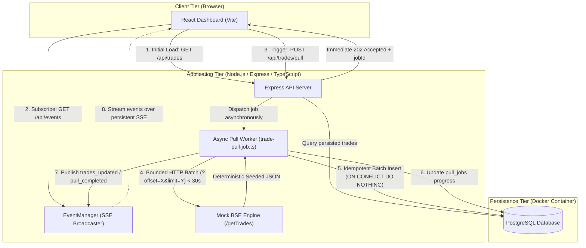

# Architecture Note: BSE Trades Dashboard

Technical assessment architecture document explaining the long-running background pull system, network timeout prevention, and real-time dashboard updates.

---

## 1. System Overview

The BSE Trades Dashboard decouples long-running exchange data ingestion from client-facing HTTP connections. Standard network infrastructure (reverse proxies, API gateways, load balancers) aggressively drops idle HTTP connections after 30 seconds, while a full trade pull can take up to 15 minutes.

To solve this, the application separates the pull trigger from background batch execution and pushes incremental updates to connected dashboards via **Server-Sent Events (SSE)**.



---

## 2. The Core Problem: The 30-Second Timeout

| Constraint           | Reality                                             | Failure Mode if Synchronous                                                              |
| -------------------- | --------------------------------------------------- | ---------------------------------------------------------------------------------------- |
| **Exchange Delay**   | Full pull simulates up to 15 minutes (~900 seconds) | A single browser request to `/getTrades` or `/pull` will freeze the client               |
| **Network Gateways** | TCP idle timeout / connection kill at 30 seconds    | `504 Gateway Timeout` or `ECONNRESET` after 30 seconds; data ingestion aborts mid-stream |

### The Anti-Pattern

Holding a single HTTP request open from the browser to the backend (or from the backend to BSE) for 15 minutes is guaranteed to fail in production.

---

## 3. The Architecture Solution

### A. Decoupled Request-Response Lifecycle

When the user clicks **"Pull Latest Trades"**:

1. The browser issues `POST /api/trades/pull`.
2. The backend generates a new job in the `pull_jobs` table and responds **immediately** with `HTTP 202 Accepted` and the `jobId` within ~15ms.
3. The HTTP connection is closed cleanly. The browser is never kept waiting.
4. The backend continues executing the pull asynchronously in-process via `setImmediate()`.

### B. Bounded HTTP Chunks to BSE

Instead of requesting all 3,000 records in one monolithic connection, the worker queries the Mock BSE API in small, bounded pages:

```
Request 1: GET /getTrades?offset=0&limit=500    --> Completes in < 1s (Demo) or 25s (Prod)
Request 2: GET /getTrades?offset=500&limit=500  --> Completes in < 1s (Demo) or 25s (Prod)
Request 3: GET /getTrades?offset=1000&limit=500 --> Completes in < 1s (Demo) or 25s (Prod)
...
```

Every individual HTTP request finishes well before the 30-second ceiling. The cumulative 15-minute delay is modeled across the total job, eliminating timeout risk.

### C. Incremental PostgreSQL Persistence & Idempotency

- Trades are inserted batch by batch inside SQL transactions.
- The `trades` table enforces a `UNIQUE(trade_id)` constraint with `ON CONFLICT (trade_id) DO NOTHING`.
- If a network glitch causes a batch to retry, duplicate records are ignored without errors or data duplication.

### D. Server-Sent Events (SSE) for Live Streaming

The browser maintains a single unidirectional event stream at `GET /api/events` (`EventSource`):

- Whenever the worker persists a batch, it emits a `trades_updated` event containing `{ jobId, recordsAdded, totalProcessed, totalRecords }`.
- When all pages have been pulled, it emits `pull_completed`.
- If an error occurs, it emits `pull_failed`.
- The dashboard updates its progress bar and trade list reactively upon receiving events.
- **Zero polling (`setInterval`)**, **zero cron jobs**, and **zero page refreshes**.

---

## 4. Why Server-Sent Events (SSE) Instead of Alternatives?

| Metric                | Polling (`setInterval`)         | WebSockets                             | Server-Sent Events (SSE)                                   |
| --------------------- | ------------------------------- | -------------------------------------- | ---------------------------------------------------------- |
| **Assessment Rule**   | ❌ Explicitly Prohibited        | Allowed                                | ✅ Recommended                                             |
| **Protocol Overhead** | High (constant HTTP handshakes) | High (stateful WS framing & handshake) | **Minimal (standard HTTP/1.1 or HTTP/2)**                  |
| **Directionality**    | Client-driven request/response  | Full bidirectional                     | **Unidirectional (Server to Client)**                      |
| **Reconnection**      | Manual logic required           | Manual reconnection required           | **Built-in native browser auto-reconnect (`retry: 3000`)** |
| **Proxy / Firewall**  | Normal HTTP                     | Often blocked or downgraded            | **Passes through standard proxies transparently**          |

Since the dashboard only requires server-to-client notifications (progress and completion), SSE is the most lightweight, idiomatic, and robust technology.

---

## 5. Concurrency & Failure Handling

### Concurrency Protection

Only one pull can run at any given time. This is guarded at two layers:

1. **Application Layer**: `startTradePull()` checks for an active job (`status = 'RUNNING'`) and immediately returns `409 Conflict`.
2. **Database Layer**: A partial unique index on `pull_jobs(status)`:
   ```sql
   CREATE UNIQUE INDEX IF NOT EXISTS idx_single_running_pull_job
   ON pull_jobs (status) WHERE status = 'RUNNING';
   ```
   Even under concurrent race conditions from multiple API instances, PostgreSQL rejects competing transactions.

### Failure Handling

- **Mock BSE Unreachable / Timeout**: Individual batch calls are bounded by an `AbortController` timer. If BSE drops or errors, the worker catches the error, marks the job `FAILED` in `pull_jobs` with the error message, and publishes a `pull_failed` SSE event to notify the UI.
- **SSE Client Disconnection**: If the browser tab is closed, the backend `EventManager` detects socket closure and removes the client connection to prevent memory leaks.
- **Keep-Alive Heartbeats**: The server sends a `: keepalive\n\n` comment every 25 seconds to prevent intermediate proxy servers from terminating idle SSE connections.

---

## 6. Architecture Trade-Offs

- **In-Process Worker vs. BullMQ / Redis**:
  - _Decision:_ For this assessment, an in-process worker (`setImmediate`) was chosen to avoid unneeded external infrastructure (Redis, message brokers).
  - _Production Evolution:_ In a multi-replica Kubernetes cluster, job dispatching would move to a durable queue (e.g. BullMQ with Redis or AWS SQS) so tasks survive server crashes and can be distributed across worker nodes.
